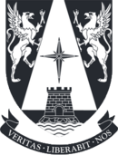

# MIA_NaturalLP 

Repositorio creado para el **Curso de Procesamiento de Lenguaje Natural (Natural Language Processing)** en el programa de **Magister en Inteligencia Artificial** de la Universidad Adolfo Ibáñez.

Profesor: John Atkinson. Facultad de Ingeniería y Ciencias, UAI.

**Eduardo Carrasco Vidal**
 

## Tareas Final:

[**Tarea final del curso.](https://github.com/educarrascov/MIA_ReinforcementLearning/blob/main/Tarea%201.ipynb). 
